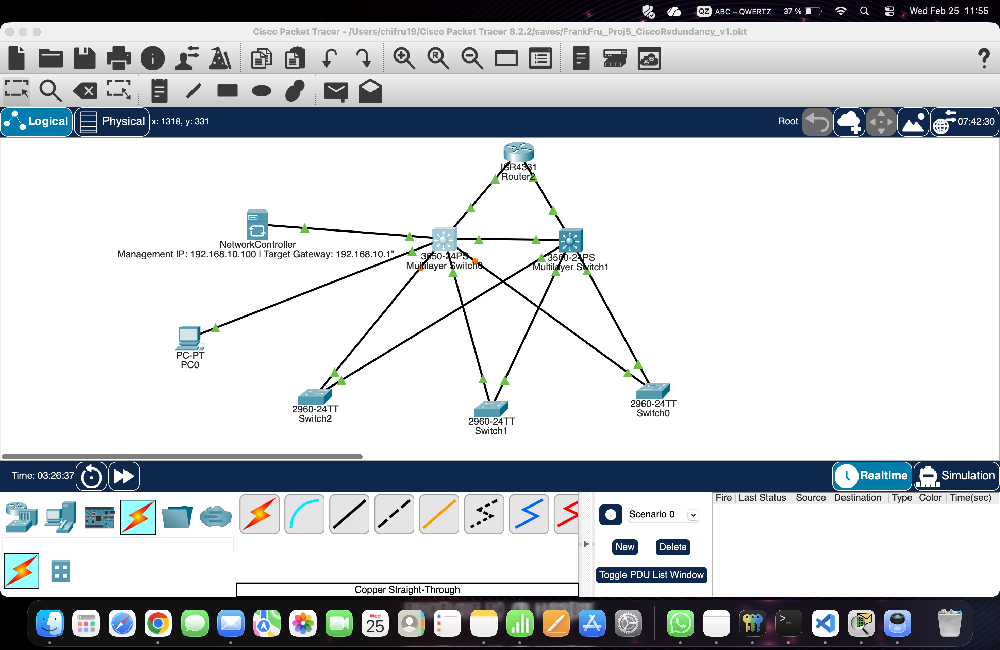

* **Cisco Networking:** HSRP Redundancy, Routed Ports, and Interface Management.
* **Infrastructure-as-Code (IaC):** Transforming manual CLI commands into repeatable Python scripts.
## Network Topology
This project is based on a redundant Cisco infrastructure built in Packet Tracer. It features a triple-link redundancy between a core router and multilayer switches to ensure zero downtime.

## Project Overview
This project demonstrates an automated **DevSecOps pipeline** for securing Infrastructure as Code (IaC). 

## Key Features
* **Automated Security Gates:** Uses GitHub Actions to scan Python-based network blueprints for vulnerabilities.
* **Vulnerability Detection:** Successfully identified and blocked insecure code (e.g., dangerous `eval()` functions).
* **Compliance-as-Code:** Ensuring all network configurations meet security standards before deployment.

## Tools Used
* **GitHub Actions:** CI/CD Automation
* **Bandit:** Static Analysis Security Testing (SAST)
* **Python:** Network Infrastructure Scripting
## Security Workflow Evidence

### 1. Automation Blocking Insecure Code
The pipeline detected a high-severity vulnerability (dangerous `eval()` statement) and blocked the deployment.

### 2. Successful Remediation
After removing the insecure code, the security gate passed, clearing the infrastructure for production.

